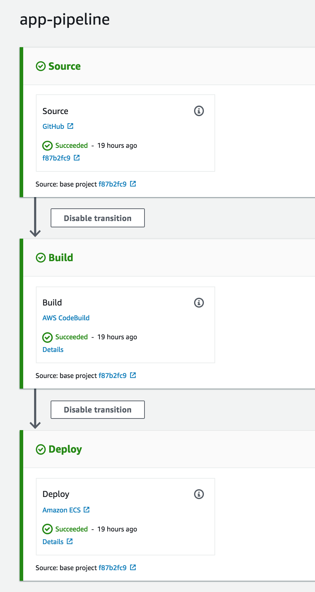

# ASI
Alius Simplex Infrastructure (another simple infrastructure)

The idea behind this repository is to describe how to create a basic reusable infrastructure to automatic deploy any containerized application whose source code is publicly available. The image will be built using **AWS Codebuild**, triggered on every commit to the master branch of the application's **GitHub** repository by **AWS Codedeploy**, then registered on **AWS ECR** and, finally, run as an **AWS ECS** cluster on **AWS Fargate**.

## TL;DR

### usage

- Create a github OAuth token and a AWS token, add whatever need to be fixed on [variables.tf](variables.tf);
- `terraform init`
- `terraform plan -var="github_token=YOUR-TOKEN"`
- `terraform apply -var="github_token=YOUR-TOKEN"`

Just wait and see the magic happens.

According to [Amazon](https://docs.aws.amazon.com/AmazonECS/latest/developerguide/AWS_Fargate.html):

> AWS Fargate is a technology that you can use with Amazon ECS to run containers without having to manage servers or clusters of Amazon EC2 instances. With AWS Fargate, you no longer have to provision, configure, or scale clusters of virtual machines to run containers. This removes the need to choose server types, decide when to scale your clusters, or optimize cluster packing.

## High level infrastructure design

## Components
- Fargate ECS cluster
  - Networking
    - VPC
    - subnets
    - routing tables
    - gateways
    - ALB
  - ECS
  - Auto Scaling
  - Hostname
  - security
- Continuous Delivery
  - CodeBuild
  - CodeDeploy
  - CodePipeline
- Acess Control
  - Endpoint whitelist

## Fargate ECS Cluster

### Networking

Initially, we need to create a VPC with, at least, 2 subnets (1 public and 1 private) in each *Availability Zone*. In order to achieve high availability, spawn the resources on more than one zone is the first thing to do as some regions have specific failures(natural disasters and thing like that) and, on these cases, the application will keep running on the others.

Also, regarding the two subnets, is more than just best practices. In order to protect the infrastructure unnecessary and unfiltered access, it's important to keep the cluster inside a private subnet which allows traffic only from resources inside the public subnet, like the Application Load Balancer and a debug box, if we need somehow.

The creation of the VPC may be seen [here](modules/fargate/main.tf#L9-L17) and the creation of subnets [here](modules/fargate/main.tf#L19-L41)

To give the public subnet access to real world, we have to create a [NAT gateway](modules/fargate/main.tf#L59-L67) and an [internet Gateway](modules/fargate/main.tf#L43-L50), associate them with an [elastic IP](modules/fargate/main.tf#L53-L57) and create [routes](modules/fargate/main.tf#L69-L90) to everything work together.

The next step is to create the Application Load Balancer on the public subnet, forwarding the requests to the ECS service inside the private subnet. The ALB contains 3 parts, the [ALB per si](modules/fargate/main.tf#L100-L108), it's [target group](modules/fargate/main.tf#L110-L119) and it's [listener](modules/fargate/main.tf#L121-L129).

### Now, we define the ECS stuff.

First, the [cluster](modules/fargate/main.tf#L135-L137 ) then the [task definition](modules/fargate/main.tf#L139-L164), which is like a blueprint for the application and defines which Docker image will be used for containers, how many containers the task will require and resource allocation for each container. Then, the [ECS service](modules/fargate/main.tf#L166-L184 ) will create the service.

### Auto scaling

Fargate allows us to auto-scale our app with not much effort. Scaling up or down is pretty easily triggered through some CloudWatch metrics, the only requirements are: create the scaling policies for both [up](modules/fargate/main.tf#L200-L215) and [down](modules/fargate/main.tf#L218-L233); and a [CloudWatch metric](modules/fargate/main.tf#L236-L251) based on some pattern like network or CPU. There are two stated, `alarm_action`, when, whatever the defined metric is passed, causing a scale up. And `OK`, which will scale down the running tasks/containers.

### Security

All [Roles](modules/fargate/main.tf#L301-L355) and [Security groups](modules/fargate/main.tf#L258-L296 ) are created to give the minimum amount of power and access to application.

### Subdomain
A simple **route53** entry to attach a new [subdomain](modules/ns/main.tf#L11-L17) connected to a previously allocated managed [domain](modules/ns/main.tf#L6-L8)

## Continuous Delivery

Before start to design the pipeline, a artifacts storage place is required. S3 is usually the way to go and is simple to [setup](modules/buildndeploy/main.tf#L7-L14).

### CodeBuild

As we have a working infrastructure, build the docker image is the next step. For that, **AWS CodeBuild** is the way to go. To define how to build is [simple](modules/buildndeploy/main.tf#L23-L51) and it will require a [file](modules/buildndeploy/appspec.yml) with the build details. The build will create the required artifacts and let them available.

### CodeDeploy

After definind the build, we have to handle the deployment. It's very [simple](modules/buildndeploy/main.tf#L100-L115) to inform Codedeploy how to handle the deployment as we already have a target cluster setted and a build definition from CodeBuild.

#### CodePipeline

Once we have networking, a working cluster and a build step, is time to set up Continuous Delivery pipeline. CodeDeploy plays a great role here and it's [full pipeline description](modules/buildndeploy/main.tf#L59-L116) is very simple to read. It basically create all the required steps to apply a hook on a github repo/branch and [get code from there](modules/buildndeploy/main.tf#L66-L82). Then, invokes CodeBuild to [build everything](modules/buildndeploy/main.tf#L84-L98) and, finally, [deploy](modules/buildndeploy/main.tf#L100-L116) into ECS fargate cluster using CodeDeploy.

The whole process is fast executed by terraform but take sometime to perform the safe deployment to the fargate cluster due to some internal security triggers.

A note is that only 3 steps were used on this pipeline butother steps may be created using the same pattern to **add a CI** or any code verification tool.

The current self-generated pipeline may be seen below:

## Acess Control

### Endpoint whitelist

By using [AWS WAF](modules/waf/main.tf) is possible to isolate some endpoints for specific address defined on the [variables](variables.tf#L25-L33) file. It's, also, possible to add extra rule-based ACL on this systems.

## METRICS
Ater running the pipeline sometimes, I've got the following time:

- **Commit reaction reaction time:** `03 min` +-
- **Build total time:** `01:30` min+-
- **Deployment total time:** `05:30` min+-

In general, from a commit to master branch on any repository to a deployed and usable self-scalable cluster with roll-back capabilities, takes about 10 minutes without any human intervention.

